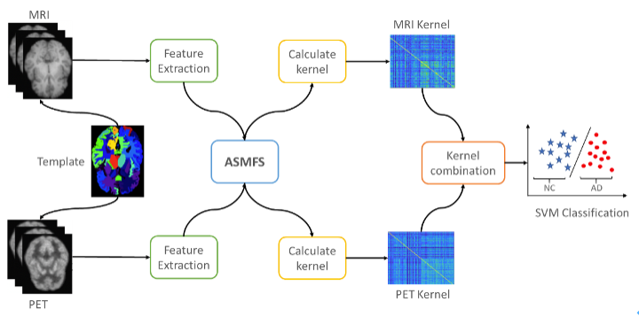

# ASMFS: Adaptive-Similarity-Based Multi-modality Feature Selection for Classification of Alzheimer's Disease

This repository is the official implementation of our paper "ASMFS: Adaptive-Similarity-based Multi-modality Feature Selection for Classification of Alzheimer's Disease".

ASMFS is a novel multi-modal feature selection method for classification of Alzheumer's Disease, which performs adaptive similarity learning and feature selection simultaneously. 

Our contributions are as follows.

- A novel multi-modality feature selection method named ASMFS is proposed to simultaneously perform similarity learning and feature selection. With the manifold hypothesis introduced, the similarity learning can derive a more accurate similarity matrix by preserving local structure information.
- An adaptive learning strategy with regard to the similarity matrix is proposed to better depict the structure of data in low-dimensional space. Therefore, the similarity matrix is more informative, and thus helpful to select more discriminative features.
- The similarity matrix is designed to be shared among different modality data collected from the same subject. By doing so, it can retrieve the collective information among multiple modalities as prior knowledge to further improve the performance of multi-modality feature selection.
- Evaluated on the AD classification task with the MRI and FDG-PET data from the ADNI database, our proposed ASMFS is demonstrated to be effective and superior in identifying disease status and discovering the disease sensitive biomarkers compared with other feature selection.

## Results

The data involved in this paper are obtained from the Alzheimer’s Disease Neuroimaging Initiative (ADNI) database (www.loni.usc.edu). The proposed method is compared with six existing multimodal classification methods including 

- standard SVM with linear kernel (denoted as SVM) [1]
- standard SVM with linear kernel and further employ LASSO [2] for feature selection (denoted as lassoSVM)
- multi-kernel SVM (denoted as MKSVM) [3]
- multi-kernel SVM with LASSO feature selection performed independently on single modality (denoted as lassoMKSVM) [4]
- multi-kernel SVM using multi-modal feature selection method (denoted as MTFS) [5]
-  multi-kernel SVM with manifold regularized multitask feature learning (denoted as M2TFS) [6]

ASMFS works well for Alzhermer's Disease classification, the results for AD vs. NC, MCI vs. NC and MCI-C vs. MCI-NC are shown below.

**Table 1** Comparison of performance of different methods for AD vs. NC classification

| Method     | Accuracy (%)                                                 | Sensitivity (%)                                              | Specificity (%)                                              | F1 Score         | AUC                                                          |
| ---------- | ------------------------------------------------------------ | ------------------------------------------------------------ | ------------------------------------------------------------ | ---------------- | ------------------------------------------------------------ |
| SVM        | 88.24±0.0972                                                 | 91.07±0.1155 | 85.57±0.1591 | 88.61±0.0925     | 0.9471±0.0007 |
| lassoSVM   | 90.90±0.0873                                                 | 90.60±0.1240 | 91.23±0.1233 | 90.71±0.0900     | 0.9460±0.0007 |
| MKSVM      | 91.87±0.0875                                                 | 92.30±0.1249 | 91.63±0.1160 | 91.68±0.0927     | 0.9526±0.0007 |
| lassoMKSVM | 92.33±0.0739                                                 | 93.47±0.1030 | 91.30±0.1261 | 92.41±0.0726     | 0.9534±0.0007 |
| MTFS       | 92.52±0.0816 | 93.77±0.1115 | 91.37±0.1213 | 92.50±0.0846     | 0.9541±0.0007 |
| M2TFS      | 95.00±0.0707 | 94.67±0.1009 | 95.40±0.0826 | 94.85±0.0740     | 0.9636±0.0006 |
| ASMFS      | **96.76**±**0.0545** | **96.10**±**0.0836** | **97.47**±**0.0660** | **96.63±0.0573** | **0.9703**±**0.0006** |

**Table 2** Comparison of performance of different methods for MCI vs. NC classification

| Method     | Accuracy (%)         | Sensitivity (%)      | Specificity (%)      | F1 Score         | AUC                   |
| ---------- | -------------------- | -------------------- | -------------------- | ---------------- | --------------------- |
| SVM        | 70.62±0.1035         | 84.03±0.1176         | 45.20±0.2111         | 81.04±0.0599     | 0.7463±0.0013         |
| lassoSVM   | 73.40±0.1167         | 81.62±0.1358         | 58.00±0.2141         | 79.78±0.0960     | 0.7852±0.0013         |
| MKSVM      | 73.17±0.0983         | 80.69±0.1141         | 59.00±0.2189         | 79.62±0.0762     | 0.7276±0.0014         |
| lassoMKSVM | 74.19±0.0894         | 86.57±0.1098         | 50.70±0.2703         | 81.44±0.0647     | 0.7539±0.0012         |
| MTFS       | 74.86±0.0911         | 82.19±0.1135         | 61.07±0.2066         | 80.91±0.0716     | 0.7296±0.0014         |
| M2TFS      | 78.97±0.0766         | **86.73**±**0.1070** | 64.53±0.2515         | 84.35±0.0561     | 0.7526±0.0014         |
| ASMFS      | **80.73**±**0.0950** | 85.98±0.1081         | **70.90**±**0.2135** | **85.30±0.0738** | **0.7875**±**0.0014** |

**Table 3** Comparison of performance of different methods for MCI-c vs. MCI-NC classification

| Method     | Accuracy (%)         | Sensitivity (%)      | Specificity (%)      | F1 Score         | AUC                   |
| ---------- | -------------------- | -------------------- | -------------------- | ---------------- | --------------------- |
| SVM        | 56.45±0.1338         | 31.55±0.2126         | 75.90±0.2024         | 36.21±0.2195     | 0.6341±0.0017         |
| lassoSVM   | 58.76±0.1394         | 48.75±0.2422         | 66.43±0.2127         | 48.69±0.1972     | 0.5830±0.0017         |
| MKSVM      | 58.80±0.1206         | 54.45±0.2293         | 62.43±0.2202         | 51.74±0.1625     | 0.5753±0.0017         |
| lassoMKSVM | 61.73±0.1369         | 51.10±0.2469         | 70.23±0.2109         | 51.67±0.2032     | 0.6086±0.0018         |
| MTFS       | 63.52±0.1220         | 59.65±0.2514         | 66.70±0.2108         | 56.63±0.1762     | 0.5894±0.0017         |
| M2TFS      | 67.53±0.1059         | 54.50±0.2629         | **77.47**±**0.1873** | 55.84±0.2182     | **0.6647**±**0.0017** |
| ASMFS      | **69.41**±**0.1194** | **65.30**±**0.2151** | 72.83±0.1811         | **63.98±0.1485** | 0.6534±0.0017         |

## Contact

- Yuang Shi, yuangshi@u.nus.edu

## Citation

@article{shi2022asmfs,
  title={ASMFS: Adaptive-Similarity-based Multi-modality Feature Selection for Classification of Alzheimer's Disease},
  author={Shi, Yuang and Zu, Chen and Hong, Mei and Zhou, Luping and Wang, Lei and Wu, Xi and Zhou, Jiliu and Zhang, Daoqiang and Wang, Yan},
  journal={Pattern Recognition},
  pages={108566},
  year={2022},
  publisher={Elsevier}
}

## References

[1]   Kloppel, S., et al. "Automatic classification of MR scans in Alzheimer’s disease.” Brain. (2008): 681-689.

[2]   Tibshirani, Robert. "Regression shrinkage and selection via the lasso: a retrospective." Journal of the Royal Statistical Society: Series B (Statistical Methodology) 73.3 (2011): 273-282.

[3]   Bach, Francis R., Gert RG Lanckriet, and Michael I. Jordan. "Multiple kernel learning, conic duality, and the SMO algorithm." Proceedings of the twenty-first international conference on Machine learning. ACM, 2004.

[4]   Huang, Shuai, et al. "Identifying Alzheimer's disease-related brain regions from multi-modality neuroimaging data using sparse composite linear discrimination analysis." Advances in neural information processing systems. 2011.

[5]   Zhang, Daoqiang, Dinggang Shen, and Alzheimer's Disease Neuroimaging Initiative. "Multi-modal multi-task learning for joint prediction of multiple regression and classification variables in Alzheimer's disease." NeuroImage 59.2 (2012): 895-907.

[6]   Jie, Biao, et al. "Manifold regularized multitask feature learning for multimodality disease classification." Human brain mapping 36.2 (2015): 489-507.

